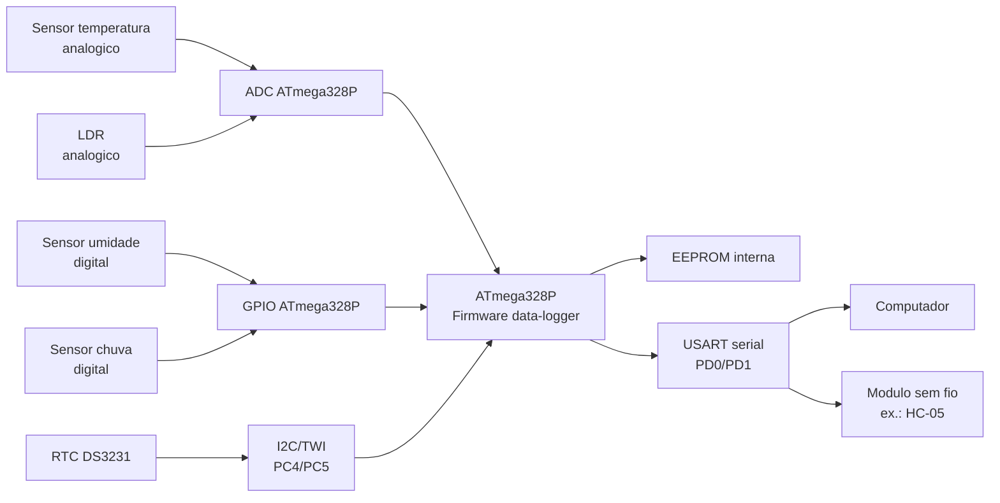

# Documentacao de Hardware

Data: 2026-07-05

## Diagrama de blocos



## Esquematico simplificado em texto

```text
ATmega328P
  PC0 / ADC0  <- sensor de temperatura analogico
  PC1 / ADC1  <- LDR
  PB0         <- sensor digital de umidade com pull-up
  PB1         <- sensor digital de chuva com pull-up
  PC4 / SDA   <-> DS3231 SDA
  PC5 / SCL   <-> DS3231 SCL
  PD0 / RXD   <- comunicacao serial
  PD1 / TXD   -> comunicacao serial
  PD2         <- jumper de selecao USART/sem fio
```

## Observacoes eletricas

- SDA e SCL precisam de resistores de pull-up.
- Sensores analogicos devem fornecer tensao dentro da faixa aceita pelo ADC.
- Sensores digitais foram tratados inicialmente como entradas com pull-up interno.
- O modulo sem fio sugerido para prototipo e um modulo serial Bluetooth, como HC-05, por permitir reaproveitar o protocolo USART.
